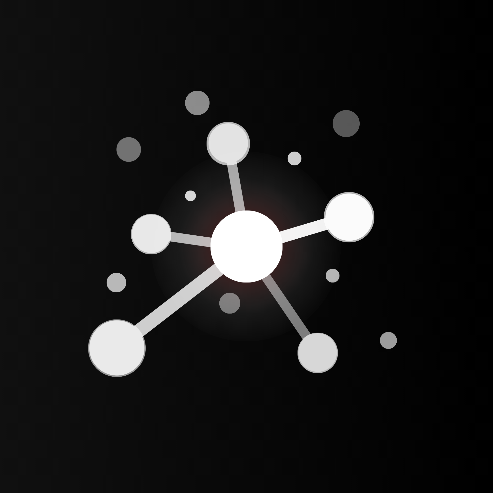

<h1 align="center">Recollect</h1>

<p align="center">
  
</p>

<div align="center">

[![License][license]][license-url]
[![Stars][stars]][stars-url]
[![Python][python]][python-url]
[![Status][status]][status-url]
[![Docker][docker]][docker-url]

</div>

<p align="center"><strong>Recollect</strong> turns the open web into a personal <strong>knowledge</strong> system — where every search becomes something you can <strong>reuse</strong>, not just forget.</p>

---

## 🧠 What is Recollect?

**Recollect is a private, local-first research tool that helps you capture, organize, and reuse information from the web.**

Instead of saving bookmarks you’ll never revisit, Recollect lets you save **actual content** — solutions, ideas, and important information — and structure it into meaningful projects.

---

## ❌ The Problem

People constantly search for information online:
- Fixing errors (e.g. from forums)
- Learning programming
- Researching topics

They:
1. Find a solution  
2. Use it once  
3. Forget it  
4. Search again later  

**Bookmarks don’t work:**
- They store links, not knowledge  
- They lack context  
- They become cluttered  

---

## 💡 The Solution

Recollect turns browsing into a **structured knowledge system**:

- 🔍 Search the web privately  
- ✂️ Save only the important parts (not entire pages)  
- 📁 Organize everything into projects  
- 🔎 Instantly find it again later  

---

## ⚙️ Core Features (MVP)

- 🔍 **Private Meta Search** (powered by SearXNG)
- ✂️ **Content-first saving** (not bookmarks)
- 📁 **Project-based organization**
- 💾 **Local-first storage**
- 🔎 **Search inside saved content**

---

## 🚀 Planned Features

- 🌐 Browser extension (highlight → save)
- 🤖 AI summarization & tagging
- 🔗 Integrations (Obsidian, Notion, etc.)
- 🎨 Custom themes
- 🔌 Plugin system
- ☁️ Cloud sync

---

## 🧩 How It Works

```
Search → Open page → Highlight → Save → Organize → Reuse
```

---

## 🎯 Use Cases

Recollect is designed for people who constantly work with information:

- 💻 Developers saving fixes, snippets, and solutions  
- 📰 Journalists collecting and structuring research  
- 📚 Students organizing learning materials  
- 🔐 Privacy-focused users who avoid tracking  

---

## 🧠 Philosophy

Recollect is built on a simple principle:

> You shouldn't have to search for the same solution twice.

Instead of passive browsing, Recollect turns the web into an **active knowledge system**.

---

## 🏗️ Architecture (Concept)

Recollect is designed as a modular system:

- 🔍 Search layer (powered by SearXNG)
- 💾 Local-first data storage
- 🌐 Optional cloud sync (future)
- 🧩 Browser extension for capturing content

---

## ⚡ Getting Started (Development)

```bash
git clone https://github.com/sarox-dev/Recollect.git
cd Recollect
```

## ⚙️ Setup and Run

### 1. Start the application

```bash
docker compose up
```
### 2. Open in your browser

http://localhost:8000

---

## 🛣️ Roadmap
### MVP
 Search UI
 Save content (manual)
 Projects system
 Local storage
### Next
 Browser extension
 Backend + authentication
 Hosted version
### Future
 AI features
 Integrations
 Plugin system
 Themes

## 🔐 Privacy

### Recollect is built with privacy in mind:

No tracking in core search
Local-first data storage
Optional self-hosting
User-controlled data

## 💰 Business Model (Planned)

### 🟢 Open Source Core
Self-hostable
Free forever

### 🟡 Hosted Free Tier
Limited storage
Basic features

### 🔴 Premium
Cloud sync
AI features
Advanced capabilities

## 🤝 Contributing

This project is currently in early development.

Contributions, ideas, and feedback are welcome:

Open an issue
Suggest features
Join the discussion on 

[![Discord][discord]][discord-url]

## 📊 Status

🚧 This project is currently in active development (WIP)

Expect:

breaking changes
incomplete features
rapid iteration

## 🙌 Support the Project

If you like the idea:

⭐ Star the repository
🐛 Report issues
💬 Join the Discord

## 🌐 Links
🌍 Website: https://recollect.saroxtech.com
 (coming soon)
💬 Discord: https://discord.gg/BXEDCJP7mT

## 📄 License
MIT © Saroxtech 2026

[Live demo](https://recollect.saroxtech.com) coming soon

[discord]: https://img.shields.io/discord/1490718135081242745?style=for-the-badge&logo=discord&logoColor=white&label=Join&labelColor=1e2124&color=7289da
[discord-url]: https://discord.gg/BXEDCJP7mT
[license]: https://img.shields.io/github/license/sarox-dev/Recollect?color=007acc
[license-url]: https://github.com/sarox-dev/Recollect/blob/main/LICENSE
[stars]: https://img.shields.io/github/stars/sarox-dev/Recollect?style=social
[stars-url]: https://github.com/sarox-dev/Recollect
[python]: https://img.shields.io/badge/Python-3.11%2B-blue?logo=python&logoColor=yellow
[python-url]: https://python.org
[status]: https://img.shields.io/badge/Status-WIP-orange
[status-url]: https://github.com/sarox-dev/Recollect
[docker]: https://img.shields.io/badge/Docker-Compose-green?logo=docker
[docker-url]: https://hub.docker.com
